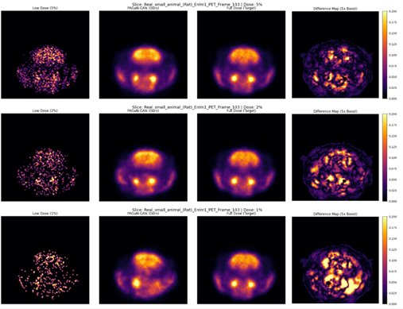
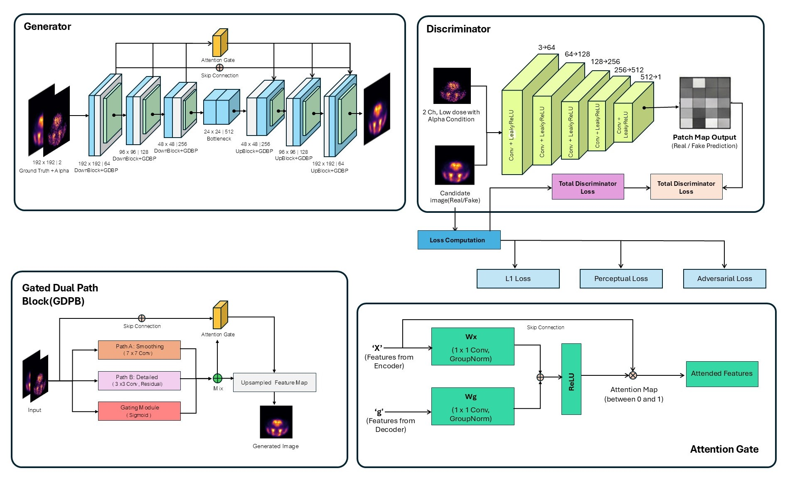

# PAGaN-GAN: Physics-Aware Gated Dual-Path Attention Network for Ultra-Low-Dose PET Denoising


> **Recovering diagnostic-quality PET images from 2% ultra-low-dose data using physics-aware deep learning.**

---

## 📌 Abstract
Positron Emission Tomography (PET) is a cornerstone imaging modality for oncology, but radiation risks necessitate minimizing the injected radiotracer dose. Reducing the dose to **2% of standard protocols** results in severe photon starvation (Poisson noise), often rendering images non-diagnostic.

**PAGaN-GAN** is a novel deep learning framework designed to solve the critical trade-off between **noise suppression** and **structure preservation**. Unlike standard U-Nets (which over-smooth lesions) or conventional GANs (which hallucinate artifacts), PAGaN uses a **Gated Dual-Path** mechanism to explicitly disentangle quantum noise from biological texture.

<p align="center">
  
  <br>
  <em>Figure 1: Reconstruction results. The PAGaN model (Center) successfully recovers lesion contrast from the noisy 2% input (Left), matching the Full-Dose Ground Truth (Right).</em>
</p>

## 🚀 Key Features
* **Physics-Aware Data Simulation:** Utilizes **Binomial Thinning** to model true Poisson photon starvation, ensuring the model learns clinically realistic noise characteristics rather than generic Gaussian noise.
* **Gated Dual-Path Architecture:** A custom neural block that splits processing into a **Smoothing Path** (for quantum noise) and a **Detail Path** (for anatomy), dynamically weighted by a learned Sigmoid Gate.
* **Attention Gates:** Integrated into skip connections to filter background noise propagation from the encoder to the decoder.

## 🏗️ Architecture
The generator is a U-Net variant enhanced with **Gated Dual-Path Blocks (GDP)** and **Attention Gates**. The discriminator is a patch-based conditional GAN (PatchGAN) that enforces high-frequency texture consistency.

<p align="center">
  
  <br>
  <em>Figure 2: The PAGaN-GAN architecture showing the Gated Dual-Path blocks and Attention mechanism.</em>
</p>

## 📊 Results
The model was evaluated on a held-out test set of 1,024 slices. We achieved robust performance even at extreme dose reduction factors.

| Dose Level | PSNR (dB) | SSIM | NRMSE |
| :--- | :--- | :--- | :--- |
| **5% Dose** | 27.83 | 0.80 | 0.0447 |
| **2% Dose (Target)** | **26.30** | **0.78** | **0.0532** |
| **1% Dose (Extreme)** | 24.78 | 0.76 | 0.0628 |

> **Qualitative Validation:** Line profile analysis confirms that PAGaN-GAN preserves the sharp intensity peaks of lesions, whereas the low-dose input suffers from significant contrast loss.

## 💻 Installation & Usage

### 1. Prerequisites
* Python 3.8+
* PyTorch 2.5.1 (CUDA 12.6 recommended)
* Monai (for medical imaging transformations)
* Pandas, Numpy, Matplotlib

```bash
pip install torch torchvision monai pandas numpy matplotlib scikit-image tqdm

### 2. Data Preparation
We simulate low-dose data using binomial thinning on high-dose acquisitions. Run the simulation notebook to generate paired data:
```bash
jupyter notebook notebooks/01_Data_Simulation.ipynb


